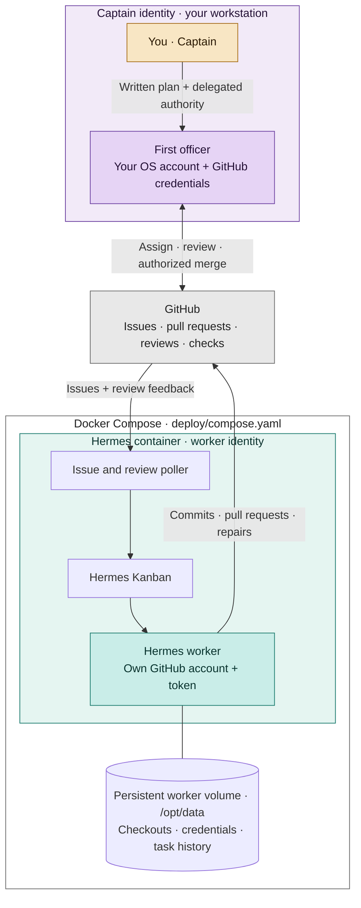

# Hermes Helmet

<p align="center">
  
</p>

**Give Hermes the wings to carry your plan through, under its own identity**

Hermes Helmet is an open-source software factory that gives
[Hermes Agent](https://github.com/NousResearch/hermes-agent) the ability to
keep going: to take on a body of work, carry it through review
and repairs, and finish within the authority you grant it. Named after the
winged helmet of the Greek god Hermes, it adds a process for long-running
autonomy, with connected tasks, review, and guardrails.

Put together a written plan with your coding agent, record the work as linked
GitHub issues, and delegate authority to carry that plan through. Hermes
implements under its own identity. Your coding agent coordinates the work,
reviews the result, directs repairs, and handles authorized merges. You can
follow progress through the Hermes Kanban board and GitHub without relaying
every handoff yourself.

Read [Hermes Helmet: giving your software factory wings](https://machine-wisdom.ai/writing/hermes-helmet-software-factory/)
for the story behind the project and examples of delivered work.

## You set the direction; your first officer sees it through

**You are the Captain.** You agree on the goal, the plan, and the authority to
act. **Your coding agent is the first officer**—Codex, Claude Code, or another
Hermes instance. It runs under your OS account and uses your credentials to
coordinate and accept work on your behalf. **Hermes is the crew**, running in
Docker with its own GitHub account, credentials, and checkout to implement,
test, and repair changes.



The skills bundled with Hermes Helmet give the first officer its operating
instructions. The `helmet` CLI supplies the checks, state transitions, and
status commands those skills use. The first officer performs the review;
Hermes does the implementation.

| Skill | What your first officer uses it for |
| --- | --- |
| [`setup-helmet`](skills/setup-helmet/SKILL.md) | Configure identities, repositories, model access, and the worker runtime. |
| [`helmet-issue`](skills/helmet-issue/SKILL.md) | Carry one issue through implementation, review, repairs, and acceptance. |
| [`helmet-epic`](skills/helmet-epic/SKILL.md) | Coordinate dependent issues and run independent work in parallel. |

In configuration and command references, **Captain-side** means the side where
your first officer operates with your delegated authority. The two GitHub
identities are `captain_github_login` and `worker_github_login`. See the
[operating model](docs/captain-and-crew.md) for their responsibilities.

## Start with one issue

Use the [quickstart](docs/quickstart.md), or point your coding agent at the
[`setup-helmet` skill](skills/setup-helmet/SKILL.md). You need Docker Compose,
Python 3.11+, a separate worker GitHub account and token, and access to your
chosen model provider.

Install the CLI from the current public source:

```sh
git clone https://github.com/MachineWisdomAI/hermes-helmet.git
cd hermes-helmet
python3 -m venv .venv
. .venv/bin/activate
python -m pip install .
helmet --help
```

The quickstart configures the worker, builds its runtime on a pinned stable
release of the official Hermes Agent Docker image, completes provider login,
and enables issue intake. Install the bundled skills into your coding-agent
host, then give your first officer one GitHub issue to carry through the
workflow. For example, after setup:

> Use helmet-issue to implement https://github.com/example-org/demo-repo/issues/123.
> Follow the issue through review, necessary repairs, and acceptance under the
> agreed merge authority.

The [September 23, 2026 public preview](https://github.com/MachineWisdomAI/hermes-helmet/releases/tag/preview-2026-09-23)
provides packaged artifacts. Its CLI command is `hermes-helmet`; current source
also installs the shorter `helmet` command used here. See the
[preview notes](docs/public-preview.md) for that release's details.

## How the work moves

Hermes Helmet connects three existing surfaces: your coding-agent host,
Hermes Agent and its Kanban executor, and GitHub. The worker runtime runs an
issue poller on the configured schedule. That poller turns eligible issues and
trusted review activity into Kanban assignments.

### From issue to pull request

The first officer uses `helmet-issue` to check the configured identity and
repository, adopt any existing task or PR, and dispatch eligible work. The
poller selects open issues with the configured `dispatch_label` in allowlisted
repositories. It records one root Kanban task per issue URL in a SQLite ledger,
so later passes can find the existing assignment.

Hermes works in a Git worktree, implements the issue, runs tests, and opens a
pull request under `worker_github_login`. It records the PR URL in its run
metadata as `published_pr`. That links the issue, assignment, branch, and PR
for the next stage.

### Review and repair on the same change

The first officer reviews the current PR commit from a separate checkout,
checks the result against the agreed outcome, and posts findings to GitHub.
The poller accepts review activity from configured repository roles and
explicitly trusted bots. It ignores approvals and the worker's own activity.

When trusted feedback arrives, the poller creates a dependent repair task
that reuses the worker's branch and worktree. Hermes fetches the current
GitHub review, comments, checks, and mergeability, makes the correction, and
pushes to the same PR. Review text stays on GitHub; the assignment points the
worker back to that record. While a repair is outstanding, the poller waits
before creating another one.

The first officer then reviews the repaired commit. A failed CI check is
input to that review; the poller starts repairs from trusted review activity.
The accepted issue defines completion, so consequential defects are repaired
without turning optional improvements into new release requirements.

### Acceptance and authorized merge

The first officer's review is recorded against a specific commit SHA. Before
an unattended merge, the merge gate checks that the live PR still has that
reviewed head, an effective approval, passing required checks, and a mergeable
state. The merge request includes the head SHA, and Hermes Helmet reads back
GitHub's merge state afterward.

You choose the merge authority. By default, the first officer asks for your
approval. An explicit whole-line `Merge when clean: yes` directive on an issue
or its parent epic authorizes it to merge once those conditions pass. A child
can narrow inherited authority with `Merge when clean: no`. Implementation and
repair stay with the worker; merging stays on the Captain side.

### Resume from the existing record

The Docker volume at `/opt/data` persists worker configuration, credentials,
checkouts, scheduler state, and task history. The poller's SQLite ledger keeps
the issue-to-task links and review progress. On your workstation, checkpoints
under `~/.hermes-helmet/checkpoints/` retain the task, PR, reviewed commit, repair
count, and merge mode.

When the first officer resumes, it reconciles those records with current
GitHub and worker state. `helmet wait` provides a bounded wait for changes;
`helmet status` reports the linked task, PR, review state, and next action.
This lets the first officer continue the existing work across sessions.

The [control-loop guide](docs/control-loop.md) and
[single-issue reference](docs/helmet-issue.md) describe the interfaces and
recovery behavior.

## Carry a plan across dependent issues

For a larger body of work, `helmet-epic` reads a parent issue and its children,
validates their dependencies, and dispatches the children whose prerequisites
are satisfied. It uses GitHub sub-issues and dependency relationships where
available, with explicit `Parent` and `Blocked by` links as the fallback.

Each child follows the same issue, review, repair, and merge workflow.
`max_epic_parallelism` bounds concurrent work, while runtime and repair budgets
bound each issue. Independent children can continue when another is blocked.
A changed dependency graph is presented for acceptance before new dispatch,
and the parent remains open for your closeout. See the
[epic guide](docs/helmet-epic.md).

## Give the worker its own identity and chosen access

One [authority policy](docs/authority-schema.md) names the company, both GitHub
identities, repositories, labels, trusted reviewers, model, merge rules, and
budgets. Setup, preflight, and task instructions use that same document. The
[ExampleCo policy](config/policy.example.json) uses `example-captain` and
`example-agent`; replace them with your two accounts.

The worker's GitHub personal access token determines what it can access and
change. The repository allowlist determines where Hermes Helmet dispatches
work. Configure each for its purpose; a dispatch list does not change the
permissions of a token. Preflight checks that the live worker login matches
`worker_github_login` and differs from `captain_github_login`.

Credentials live in owner-only runtime files, outside the policy and source.
The Docker entrypoint prepares the worker token file and removes the token
variables before starting the supervised services; the GitHub CLI wrapper
loads the token for GitHub commands. The first officer retains your credentials
on the Captain side. Company-specific configuration belongs in your
[private overlay](docs/private-overlay.md).

## Keep the workflow as models change

Choose the coding agent that acts as first officer separately from the model
behind the Hermes worker. The policy's `inference_provider` and
`inference_model` select the worker's model. Changing that selection preserves
the worker's task records and GitHub identity, and the first officer keeps its
review responsibilities.
See [provider and model configuration](docs/model-lanes.md) for hosted
providers and compatible local endpoints.

GitHub preserves the feedback and acceptance history for each change. Optional
memory integrations make context and accepted lessons available across clients:

| Integration | What it adds |
| --- | --- |
| [OpenViking](docs/openviking.md) | Working context across sessions and clients. |
| [FAVA Trails](docs/fava-trails.md) | Governed decisions and observations, with approval, provenance, and supersession. |
| [Company skill packs](docs/company-skills.md) | Your own instructions imported into Hermes-owned state. |

Promotion from working context into FAVA Trails is explicit. These integrations
can be added to the core issue-to-merge workflow when you need them.

## Develop and contribute

Follow [CONTRIBUTING.md](CONTRIBUTING.md) for code and documentation changes
and the [security policy](SECURITY.md) for vulnerability reports. Run the
repository checks before submitting a change:

```sh
scripts/verify.sh
```

Build and smoke-test a local development image with
`scripts/build-dev-image.sh` and `scripts/smoke-dev-image.sh`.

## Documentation

- [Quickstart](docs/quickstart.md) and [setup diagnostics](docs/setup-helmet.md)
- [Captain, first officer, and crew](docs/captain-and-crew.md)
- [Single issues](docs/helmet-issue.md) and [dependent issues](docs/helmet-epic.md)
- [Control loop](docs/control-loop.md) and [authority policy](docs/authority-schema.md)
- [Public preview](docs/public-preview.md) and [changelog](CHANGELOG.md)
- [Code of conduct](CODE_OF_CONDUCT.md)

## License

Hermes Helmet is licensed under Apache-2.0. See [LICENSE](LICENSE) and
[NOTICE](NOTICE). OpenViking is an optional AGPL-3.0 service; enabling it is
an adopter choice.
